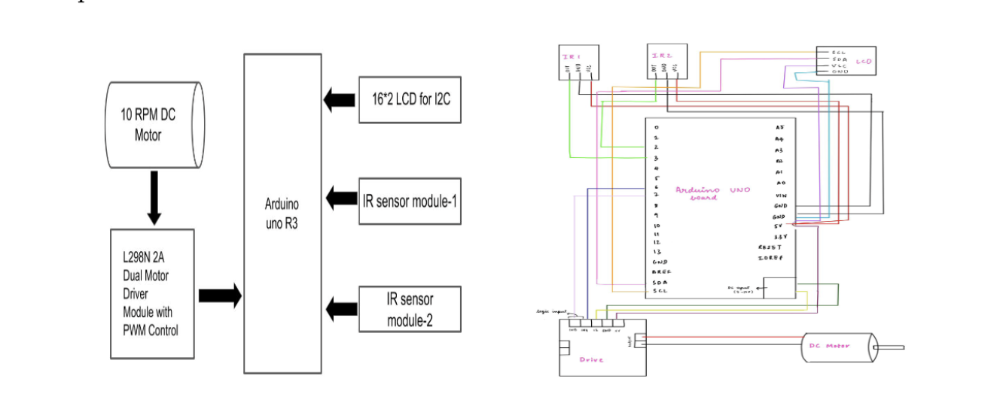

# Smart Trash Can IoT

An automated and hygienic trash disposal system built using **Arduino Uno**, **IR sensors**, and a **DC motor**, designed to address problems in public waste management. The lid opens automatically on object detection and displays real-time bin status on an LCD.

---

## 📌 Features
- **Touchless Waste Disposal**: Lid opens and closes automatically via IR detection.
- **Full Bin Detection**: Internal IR sensor triggers "FULL" alert.
- **LCD Display**: Displays bin status messages like "OPENING", "CLOSING", "FULL", and "EMPTY".
- **Stability Tested**: Works reliably under different lighting and extended usage.
- **Accessible Design**: Ideal for public spaces, healthcare facilities, and even use by physically challenged individuals.

---

## ⚙️ Components Used
- Arduino Uno R3
- IR Obstacle Avoidance Sensors (x2)
- L298N Dual Motor Driver Module
- 10 RPM DC Motor
- 16x2 LCD (I2C)
- 12V 1A Power Supply (SMPS)
- Jumper wires, bin body, metal lid

---

## 🛠️ How It Works
1. **IR Detection**: Detects hand/object in front of the bin.
2. **Lid Actuation**: Triggers the motor via L298N to open lid.
3. **Auto-Close**: Lid closes after a short delay.
4. **Level Monitoring**: Additional IR sensor inside bin detects full status.
5. **User Feedback**: LCD displays status updates to the user.

---

## 🧪 Testing & Results
- All components tested individually and integrated.
- Stability and long-term usage validated.
- Achieved accurate detection and lid control.
- Full/empty state displayed correctly.

---

## 📈 Future Work
- Waste segregation (bio/non-bio detection)
- Solar-powered compression
- Automatic lid lock on full detection
- Government alert system via SMS with location
- Wireless monitoring via mobile app

---

## 📷 Screenshots & Circuit

